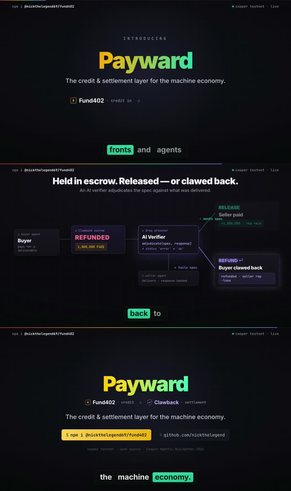

# Fund402 + Clawback — 90-second product demo

A premium, technical product film in two acts: **Fund402** (just-in-time credit) and
**Clawback** (escrow + AI-adjudicated disputes) — the credit & settlement layer for the
machine economy.

**▶ [`fund402-promo.mp4`](./fund402-promo.mp4)** · 1920×1080 · 90s · H.264 + music



## What it shows

### Act I — Fund402 (credit on the way in)

| Beat | Time | Content |
|---|---|---|
| **The problem** | 0–7.5s | An agent hits `402 Payment Required` with a `0.00 USDC` wallet — *"AI agents can transact. They can't pay."* |
| **The reveal** | 7.5–15.5s | `Fund402` — *just-in-time credit + x402 settlement on Casper* · `npm i @nickthelegend69/fund402` |
| **The code** | 15.5–25s | The real API — server `paywall()` + client `fund402Fetch()`, side by side |
| **Live proof** | 25–35.5s | The on-chain pipeline: agent → 402 → the vault fronts the payment → settled on Casper → `200 OK` (`deploy 96f30ddf…`, `status processed`) |
| **The yield** | 35.5–45s | The pool compounds — deposit `2,000,000` → withdraw `2,050,000` (+2.5%); 5% fee → LP yield via `repay_latest()` |

### Act II — Clawback (protection on the way out)

| Beat | Time | Content |
|---|---|---|
| **The second layer** | 45–54s | `Clawback` — agent payment **escrow** with **AI-adjudicated** disputes. A separate settlement layer: Fund402 fronts the payment, Clawback escrows it. |
| **The dual path** | 54–71s | The escrow state machine — buyer escrows (`HELD`) → seller delivers → the **Groq attester** adjudicates → **RELEASE** (seller paid) *or* **DISPUTE → REFUND** (buyer clawed back). Both paths shown, both proven on-chain (`open 02bfd9cf…` / `release 87a30923…` · `dispute 0106f5e0…` / `resolve f6f6c5db…`). |

### Act III — the stack + CTA

| Beat | Time | Content |
|---|---|---|
| **The stack** | 71–81s | One `npm install`, a whole stack — SDK · Agent · MCP · Skills · Clawback · *8 open-source repos, live on casper-test* |
| **CTA** | 81–90s | `Fund402 + Clawback` — *credit on the way in · protection on the way out* — the credit & settlement layer for the machine economy |

Every number and deploy hash on screen is real — see [DEPLOYMENT.md](../DEPLOYMENT.md),
[STATUS.md](../STATUS.md), and the [Clawback repo](https://github.com/nickthelegend/clawback-casper).

## How it was built

The film is a [HyperFrames](https://hyperframes.heygen.com) composition — **video
rendered from HTML**. Each scene is a self-contained HTML file with a seekable GSAP
timeline; the framework captures the 90s timeline headlessly and encodes it. Clawback
gets a distinct violet accent so the two layers read apart.

```
source/
  index.html                       # master assembly — 9 scenes + persistent chrome
  compositions/
    scene1-hook.html                # the 402 problem
    scene2-reveal.html              # the Fund402 reveal + npm install
    scene3-code.html                # paywall() + fund402Fetch()
    scene4-flow.html                # the live on-chain flow + receipt
    scene5-yield.html               # the pool compounds (LP yield)
    scene6-clawback-intro.html      # Clawback — the settlement layer
    scene7-clawback-flow.html       # escrow → AI judge → release | clawback
    scene8-ecosystem.html           # one install, the whole stack
    scene9-cta.html                 # Fund402 + Clawback finale
  assets/bgm/track.mp3              # background score (HeyGen music library)
  STORYBOARD.md                     # brief + music mood
```

Rebuild it:

```bash
cd source
npx hyperframes lint && npx hyperframes validate   # check the composition
npx hyperframes render --quality high --output video.mp4
# then mux the music bed (looped to 90s, fades):
ffmpeg -y -stream_loop -1 -i assets/bgm/track.mp3 -t 90 \
  -af "afade=t=in:st=0:d=0.8,afade=t=out:st=88:d=2,volume=0.82" bgm.m4a
ffmpeg -y -i video.mp4 -i bgm.m4a -map 0:v -map 1:a -c:v copy -c:a aac -shortest fund402-promo.mp4
```

Design system: near-black `#07070b`, Inter + JetBrains Mono. Fund402 accents red
`#ff3b5c` / gold `#f5b301` / teal `#25d3a6` / blue `#5b8cff`; Clawback accent violet
`#a18cff`. Dark, technical, developer-grade.
